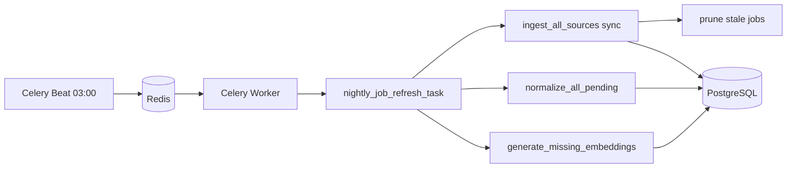

# Deployment Requirements — Job Aggregation MVP

> **Maintainer / agent reminder:** Before changing Docker, Celery, ingestion, or env vars, re-read this file. Nightly ingest only works if **`worker` + `beat` + `redis` + `db`** run together and migrations completed. Do not deploy `web` alone and expect 03:00 sync.

## Will Docker do it automatically?

| Step | Automatic on `docker compose up`? | Notes |
|------|-----------------------------------|--------|
| Start Postgres / Redis | Yes | `db`, `redis` services |
| Run Django migrations | **Yes** (if using current `docker-compose.yml`) | `web` and `beat` run `migrate --noinput` on start |
| Register 03:00 nightly task | **Yes** | `beat` runs `setup_nightly_schedule` on start |
| Execute nightly ingest at 03:00 | **Yes** | Celery Beat → `nightly_job_refresh_task` → `worker` |
| Populate DB on first deploy before 03:00 | **No** | Run manual refresh once (see below) |
| Production hardening (HTTPS, gunicorn, secrets) | **No** | Dev-oriented compose; see production section |

**Short answer:** After deploy, you do **not** need a separate cron on the host **if** all Compose services are up and `.env` has API keys. You **do** need a correct first-time checklist (migrations are automated; optional first ingest is not).

---

## Required services (all must run)

```text
web      → Django API + UI
worker   → runs Celery tasks (ingest, normalize, embeddings)
beat     → triggers nightly schedule
db       → PostgreSQL (persistent volume)
redis    → Celery broker + result backend
```

If the host only runs `web`, **nothing runs at 03:00**.

Verify on server:

```bash
docker compose ps
# Expect: web, worker, beat, db, redis — all Up
```

---

## First deploy checklist

1. **Copy env on server** (never commit `.env`):

   ```bash
   cp .env.example .env
   # Edit: DJANGO_SECRET_KEY, DJANGO_DEBUG=false, DJANGO_ALLOWED_HOSTS,
   #       POSTGRES_*, ADZUNA_*, USAJOBS_*, INGEST_SCHEDULE_*
   ```

2. **API keys** (required for nightly ingest):

   - `ADZUNA_APP_ID`, `ADZUNA_APP_KEY`
   - `USAJOBS_API_KEY`, `USAJOBS_USER_AGENT`
   - `REMOTIVE_BASE_URL` (no key; public API)

3. **Start stack:**

   ```bash
   docker compose up -d --build
   ```

4. **Confirm beat registered schedule** (logs):

   ```bash
   docker compose logs beat | tail -20
   # Should show setup_nightly_schedule success and beat Starting
   ```

5. **Confirm periodic task in DB** (optional):

   ```bash
   docker compose exec web python manage.py shell -c "
   from django_celery_beat.models import PeriodicTask
   t = PeriodicTask.objects.get(name='nightly-job-refresh')
   print(t.enabled, t.task, t.crontab)
   "
   ```

6. **First data load** (recommended — do not wait until 03:00):

   ```bash
   docker compose exec web python manage.py shell -c "
   from apps.jobs.tasks import nightly_job_refresh_task
   print(nightly_job_refresh_task())
   "
   ```

   USAJOBS + Adzuna can take several minutes.

---

## Every deploy / update checklist

1. `git pull` (or CI artifact) on server  
2. `docker compose up -d --build`  
3. Migrations run automatically on `web` / `beat` restart  
4. `setup_nightly_schedule` runs automatically on `beat` restart (updates crontab from `.env`)  
5. Confirm `worker` and `beat` are still **Up** after deploy  

No extra host crontab is required.

---

## Environment variables (deployment)

| Variable | Purpose |
|----------|---------|
| `INGEST_SCHEDULE_TIMEZONE` | Default `Europe/Istanbul` |
| `INGEST_SCHEDULE_HOUR` | Default `3` (03:00 local to timezone above) |
| `INGEST_SCHEDULE_MINUTE` | Default `0` |
| `INGEST_PAGE_SIZE_*` / `INGEST_MAX_PAGES_*` | Max fetch per source |
| `CELERY_BROKER_URL` | Must reach Redis (`redis://redis:6379/0` in Compose) |
| `CELERY_RESULT_BACKEND` | Same Redis URL |

Changing schedule: edit `.env`, then `docker compose restart beat`.

---

## Verification commands

```bash
# Services running
docker compose ps

# Worker consumes tasks
docker compose logs worker --tail 50

# Beat scheduler
docker compose logs beat --tail 50

# Job counts after manual or nightly run
docker compose exec web python manage.py shell -c "
from apps.jobs.models import JobPosting
from django.db.models import Count
print(JobPosting.objects.values('source').annotate(n=Count('id')))
"
```

---

## Common failures

| Symptom | Cause | Fix |
|---------|--------|-----|
| No new jobs at 03:00 | `beat` or `worker` not running | `docker compose up -d beat worker` |
| Beat container exits on start | DB not ready / migrations failed | Check `docker compose logs beat`; ensure `db` healthy; rerun `up` |
| Ingest returns errors | Missing API keys in server `.env` | Set Adzuna + USAJOBS vars; restart `worker` |
| Empty search after deploy | No ingest yet | Run manual `nightly_job_refresh_task` once |
| Schedule wrong time | Wrong `INGEST_SCHEDULE_*` or timezone | Fix `.env`; `docker compose restart beat` |

---

## Production notes (not in repo yet)

Current `docker-compose.yml` is **development-oriented**:

- `runserver` instead of gunicorn/uvicorn  
- `DJANGO_DEBUG=true` in example  
- Source code volume mount (`.:/app`) — fine for demo VM, not ideal for immutable prod images  

For a real production deploy, also plan:

- `DJANGO_DEBUG=false`, strong `DJANGO_SECRET_KEY`  
- Reverse proxy (nginx/Caddy) + TLS  
- `restart: unless-stopped` on all services (added in compose)  
- Backups for `postgres_data` volume  
- Monitor disk (USAJOBS ingest can grow DB)  

---

## Architecture (nightly path)



---

## Related files

- `docker-compose.yml` — service definitions, migrate + schedule on start  
- `backend/apps/jobs/management/commands/setup_nightly_schedule.py`  
- `backend/apps/jobs/tasks.py` — `nightly_job_refresh_task`  
- `.env.example` — template for server `.env`
