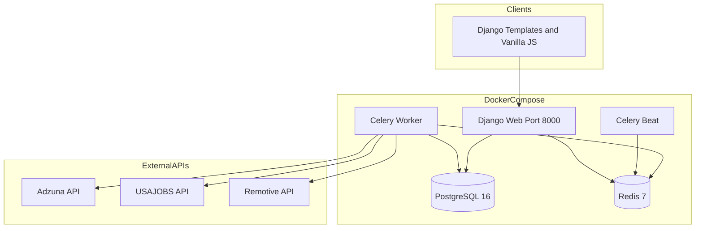
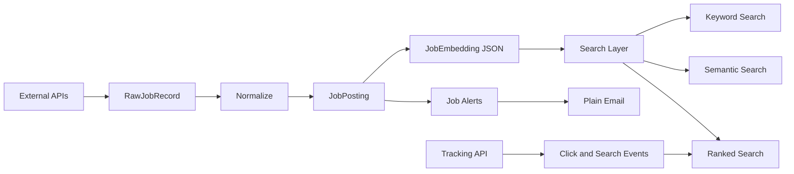

# SWE599 Smart Jobs — Project Status Report

> Repository audit: May 2026. Based on actual code only.  
> DB snapshot (Docker): 21 `JobPosting`, 21 `RawJobRecord`, 21 `JobEmbedding`. Tests: 12 passing.

---

## 1. Current Implemented Features

### Backend apps and database models

| App | Models | Purpose |
|-----|--------|---------|
| `apps.jobs` | `RawJobRecord`, `JobPosting` | Ingestion + normalized jobs |
| `apps.search` | `JobEmbedding` | Embeddings stored in Postgres JSON |
| `apps.alerts` | `JobAlert`, `AlertDeliveryLog` | Alerts + delivery deduplication |
| `apps.tracking` | `UserSearchEvent`, `JobClickEvent` | Search/click events (optional `user`) |

`apps.users` was removed. No login/register API.

### API endpoints

| Method | Endpoint | View |
|--------|----------|------|
| GET | `/api/jobs/` | `JobListAPIView` |
| GET | `/api/jobs/<id>/` | `JobDetailAPIView` |
| GET | `/api/jobs/search/` | `JobSearchAPIView` |
| GET | `/api/jobs/semantic-search/?q=` | `SemanticJobSearchAPIView` |
| GET | `/api/jobs/ranked-search/` | `RankedJobSearchAPIView` |
| GET/POST | `/api/alerts/` | `AlertListCreateAPIView` |
| GET/PATCH/DELETE | `/api/alerts/<id>/` | `AlertDetailAPIView` |
| POST | `/api/tracking/search/` | `TrackSearchEventAPIView` |
| POST | `/api/tracking/click/` | `TrackClickEventAPIView` |

**Not implemented:** `/api/auth/*` (README still mentions them).

### Frontend pages

| URL | Template | JavaScript |
|-----|----------|------------|
| `/` | redirect → `/search/` | — |
| `/search/` | `backend/templates/search.html` | `search.js`, `api.js` |
| `/alerts/` | `backend/templates/alerts.html` | `alerts.js`, `api.js` |
| `/login/` | redirect → `/search/` | — |
| `/admin/` | Django admin | — |

Stack: Django templates + vanilla JS (no React/Vue). **Tracking APIs are not called from the UI.**

### Celery background tasks

| Task | File |
|------|------|
| `ingest_all_sources_task` | `apps/jobs/tasks.py` |
| `ingest_source_task` | `apps/jobs/tasks.py` |
| `normalize_raw_records_task` | `apps/jobs/tasks.py` |
| `generate_missing_job_embeddings_task` | `apps/search/tasks.py` |
| `process_job_alerts_task` | `apps/alerts/tasks.py` |

Celery Beat runs via `docker-compose.yml` with `DatabaseScheduler`, but **no periodic schedules are defined in code** (configure in Django admin or run manually).

### Feature checklist

| Feature | Status | Evidence |
|---------|--------|----------|
| Ingestion (Adzuna, USAJOBS, Remotive) | Yes | `adapters/adzuna.py`, `usajobs.py`, `remotive.py` |
| Normalization | Yes | `normalization_pipeline.py`, per-source normalizers |
| Duplicate detection | Partial | Unique `content_hash`; cross-source skip (no merge) |
| Semantic search | Yes (MVP) | `semantic_search.py` — Python cosine over all embeddings |
| Embeddings generated and stored | Yes | `JobEmbedding.embedding` JSONField |
| Vector database | No | Postgres JSON only, not pgvector |
| Keyword filters | Yes | `job_search.py` |
| Email alerts | Yes (plain text) | `matching.py` → `send_mail()` |
| RAG email generation | No | No LLM/RAG code |
| Click/search tracking | API yes, UI no | `tracking/views.py` |
| Ranking + click weighting | Yes | `ranking.py` |

---

## 2. SRS vs Implementation

| Requirement ID | Requirement Summary | Status | Evidence in Code | Notes |
|----------------|---------------------|--------|------------------|-------|
| FR-01a | Fetch Adzuna | Implemented | `adapters/adzuna.py` | Needs `ADZUNA_*` env |
| FR-01b | Fetch USAJOBS | Implemented | `adapters/usajobs.py` | Needs `USAJOBS_*` env |
| FR-01c | Fetch Remotive | Implemented | `adapters/remotive.py` | Public API |
| FR-01d | Store raw responses | Implemented | `RawJobRecord.payload` | |
| FR-01e | Scheduled ingestion | Partially | Celery Beat container only | No cron in repo |
| FR-01f | Background jobs | Implemented | `@shared_task` | |
| FR-01g | Separate fetch vs email tasks | Implemented | `ingest_*` vs `process_job_alerts_task` | |
| NFR-01a | Retry on failures | Partially | HTTP retries in `adapters/base.py` | |
| NFR-01b | Ingestion performance | Needs verification | — | |
| FR-02a | Unified JobPosting schema | Implemented | `JobPosting` model | |
| FR-02b | Normalize titles | Partially | `normalized_title` field | |
| FR-02c | Employment type categories | Partially | Raw API strings stored | UI uses `full_time` / `contract` |
| FR-02d | Normalize location | Implemented | `city`, `country`, `location_text` | |
| FR-02e | Normalize salary | Partially | `salary_*` fields parsed | |
| FR-02f | Clean descriptions | Implemented | `description_clean` | |
| FR-02g | Content hashes | Implemented | `build_content_hash()` | |
| FR-02h | Cross-source dedupe | Partially | Skip on hash match | No field merge |
| NFR-02a | Schema consistency | Implemented | Single model | |
| NFR-02b | Preserve raw data | Implemented | `RawJobRecord` | |
| FR-03a | Keyword search | Implemented | `apply_job_filters` | |
| FR-03b | Location filter | Implemented | API + UI | |
| FR-03c | Employment type filter | Implemented | API + UI | Match quality varies |
| FR-03d | Remote filter | Implemented | API + UI | |
| NFR-03a | Search under 2s | Needs verification | — | |
| NFR-03b | Simple search UI | Implemented | `search.html` | |
| FR-04a | Generate embeddings | Implemented | `LocalHashEmbeddingProvider` | Hash MVP, not transformer |
| FR-04b | Cosine similarity | Implemented | `similarity.py` | |
| FR-04c | Rank by semantic score | Implemented | `semantic_search_jobs` | |
| FR-04d | Vector database storage | Not implemented | JSONField in Postgres | |
| FR-04e | LLM query enhancement | Not implemented | — | Optional in SRS |
| FR-04f | Hybrid keyword + semantic | Partially | Ranked search only | Semantic endpoint ignores filters |
| NFR-04a | Semantic under 3s | Needs verification | O(n) scan | |
| NFR-04b | Better than keyword | Needs verification | Weak hash embeddings | |
| FR-05a | Create alerts | Implemented | Alerts API + UI | Shared global list |
| FR-05b | Email notifications | Implemented | `process_job_alerts` | |
| FR-05c | Top jobs in email | Implemented | Plain list in body | |
| NFR-05a | Email reliability | Partially | Console backend default | |
| NFR-05b | Async email | Implemented | Celery task | |
| FR-06a | Record clicks | Implemented | API only | UI not wired |
| FR-06b | Record searches | Implemented | API only | UI not wired |
| FR-06c | Store rank position | Implemented | `JobClickEvent` | |
| FR-06d | Email link clicks | Not implemented | — | |
| NFR-06a | Secure storage | Partially | Anonymous events | |
| NFR-06b | No UX impact | Implemented | No UI tracking calls | |
| FR-07a | Click-weighted ranking | Implemented | `ranking.py` | Global when anonymous |
| FR-07b | Embeddings in ranking | Implemented | `rank_jobs()` | |
| FR-07c | Future behavioral signals | Not implemented | — | |
| FR-07d | Email click signals | Not implemented | — | |
| NFR-07a | Ranking performance | Needs verification | — | |
| NFR-07b | Scalability | Partially | No vector index | |
| FR-08a | RAG context to LLM | Not implemented | — | |
| FR-08b | RAG email summaries | Not implemented | — | |
| FR-08c | Summaries in emails | Not implemented | — | |
| FR-08d | Future personalization | Not implemented | — | |
| FR-10a | Job search APIs | Implemented | `apps/search/urls.py` | |
| FR-10b | Job detail API | Implemented | `JobDetailAPIView` | Not used in UI |
| FR-10c | Alert APIs | Implemented | `apps/alerts/urls.py` | |
| FR-10d | Tracking APIs | Implemented | `apps/tracking/urls.py` | |
| NFR-10a | API performance | Needs verification | — | |
| NFR-10b | Security without login | Implemented | `AllowAny` | |
| FR-11a | Anonymous search | Implemented | — | |
| FR-11b | Alerts without login | Implemented | — | |
| FR-11c | Optional notify email | Implemented | `notify_email` field | |
| NFR-11a | Privacy without accounts | Implemented | Nullable tracking user | |

---

## 3. Architecture

### System overview (Mermaid)



### Data pipeline (Mermaid)



### Technology stack

| Layer | Technology |
|-------|------------|
| Backend | Django + Django REST Framework |
| Frontend | Server-rendered HTML, CSS, vanilla JS |
| Database | PostgreSQL (SQLite for tests) |
| Queue | Redis + Celery + django-celery-beat |
| Embeddings | `LocalHashEmbeddingProvider` (token hashing) |
| Vector storage | `JobEmbedding.embedding` JSONField in Postgres |
| API prefix | `/api/jobs/`, `/api/alerts/`, `/api/tracking/` |
| Docker | `web`, `worker`, `beat`, `db`, `redis` |

---

## 4. Missing Items Before Final Presentation

### Must fix

1. Load demo data: ingest → normalize → embeddings before presenting.
2. Update README (remove auth/login; document anonymous alerts).
3. Present honestly: no RAG, no real vector DB, hash embeddings MVP.
4. Verify API keys in `.env` (Adzuna, USAJOBS); Remotive as fallback.
5. Test employment filter with real ingested values.
6. Set `ALERT_DEFAULT_EMAIL` or `notify_email` for alert email demo.

### Nice to have

- Wire tracking from UI (search + job click).
- Celery Beat periodic task in Django admin.
- Apply filters on semantic search endpoint.
- Django admin registration for models.

### Future work (explain in presentation)

- RAG-based alert emails (SRS Feature 8).
- Vector DB / pgvector + real embedding model.
- Per-user alerts and authentication.
- Email click tracking.
- ANN indexing for scale.

---

## 5. Demo Readiness

### Can it be demoed now?

**Yes**, as an MVP: ingestion pipeline, search modes, alerts, Docker stack — if data is preloaded and scope is stated clearly.

### Start commands

```bash
docker compose up --build
docker compose exec web python manage.py migrate
```

### Pipeline (if database is empty)

```bash
docker compose exec web python manage.py shell -c "from apps.jobs.tasks import ingest_all_sources_task; print(ingest_all_sources_task())"
docker compose exec web python manage.py shell -c "from apps.jobs.tasks import normalize_raw_records_task; print(normalize_raw_records_task())"
docker compose exec web python manage.py shell -c "from apps.search.tasks import generate_missing_job_embeddings_task; print(generate_missing_job_embeddings_task())"
```

### Pages and endpoints to show

| Show | URL |
|------|-----|
| Search UI (3 modes) | http://localhost:8000/search/ |
| Alerts UI | http://localhost:8000/alerts/ |
| Keyword API | `GET /api/jobs/search/?keyword=python` |
| Semantic API | `GET /api/jobs/semantic-search/?q=backend` |
| Ranked API | `GET /api/jobs/ranked-search/?keyword=python` |

### Avoid showing

- Login/register (removed).
- RAG or LLM email generation (not built).
- Per-user private alerts (shared list).
- Live ingestion if API keys are untested.

### Risks

- README outdated (auth references).
- No UI tracking → ranked search won't reflect clicks unless API called manually.
- Semantic search ignores location/remote filters.
- Hash embeddings: weak semantic demos; use queries close to job titles.

---

## 6. Action Plan (Next Few Days)

### Day 1 — Stability

- [ ] Run full pipeline; confirm job count in DB.
- [ ] Fix README demo flow.
- [ ] Prepare 3 search queries that work on your data.
- [ ] Test alert email with `ALERT_DEFAULT_EMAIL`.

### Day 2 — Polish

- [ ] Optional: Django admin for `JobPosting`, `JobAlert`.
- [ ] Optional: POST tracking events, rerun ranked search.
- [ ] Update presentation slides: implemented vs future.

### Day 3 — Rehearsal

- [ ] Dry-run demo twice (including empty DB rebuild).
- [ ] Run `docker compose exec web python manage.py test`.
- [ ] Backup screenshots if live APIs fail.

---

## Summary

**Implemented:** Multi-source ingestion, normalization, dedupe-by-hash, keyword/semantic/ranked search, JSON embeddings in Postgres, plain email alerts, tracking APIs, Celery tasks, Docker, demo UI.

**Not implemented:** RAG emails, dedicated vector database, scheduled ingestion in code, UI tracking, email click tracking, full employment-type normalization.

**Demo-ready** if data is preloaded, commands are scripted, and SRS scope is presented honestly.
