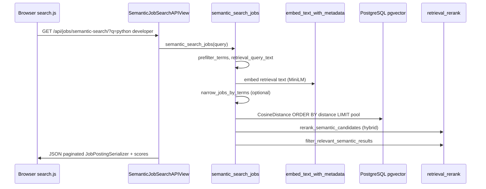
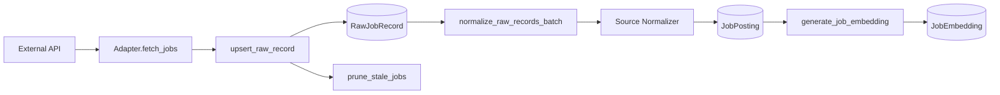
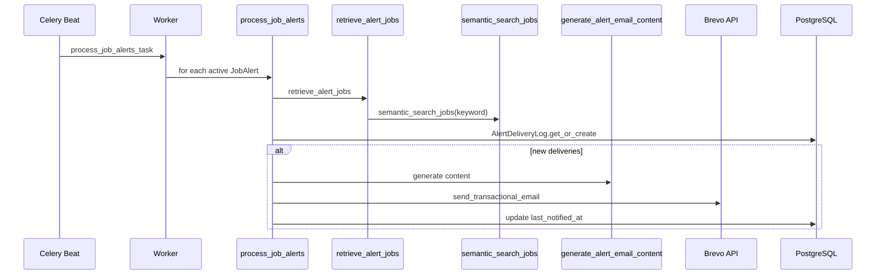
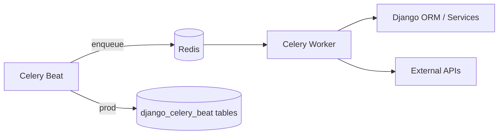
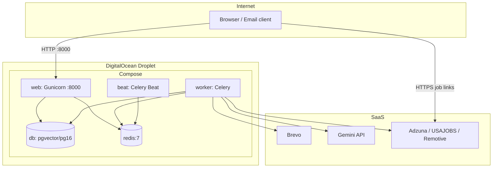

# JobSense AI (SWE599) — Technical Architecture Report

**Repository:** `https://github.com/yaseminsirin/SWE599`  
**Purpose:** MSc Software Engineering project — technical reference for formal report writing  
**Evidence base:** Code traced as of commit `a4eab3b` (plus local uncommitted UI browse changes in `search.js` / `search.html`)

---

# 1. Project Overview

## Problem

The system addresses **fragmented job discovery** across multiple public APIs (Adzuna, USAJOBS, Remotive). Users cannot search one unified corpus with both keyword precision and natural-language intent. The project also automates **personalized job alerts** with email delivery and optional RAG-generated copy.

**Evidence:** `SRS.md` (Features 1–4), `README.md` lines 1–10.

## Main user flows

| Flow | Steps | Evidence |
|------|-------|----------|
| **Browse jobs** | Open `/search/` → empty query loads `GET /api/jobs/` paginated | `backend/static/js/search.js` (`buildRequest`, `loadJobs(1)` on init) |
| **Semantic search** | Enter query → `GET /api/jobs/semantic-search/?q=...` | `SemanticJobSearchAPIView`, `search.js` |
| **Create alert** | From search UI → `POST /api/alerts/` with keyword + email | `search.js` `buildAlertPayload`, `AlertListCreateAPIView` |
| **Nightly data refresh** | Celery Beat → ingest → normalize → embed | `nightly_job_refresh_task` |
| **Nightly alerts** | Celery Beat → match → RAG email → Brevo | `process_job_alerts_task`, `matching.py` |
| **Click tracking** | Optional `POST /api/tracking/click/`; alert emails link to external `job_url` | `tracking/views.py`, `email_generation.py` |

## High-level architecture

```mermaid
flowchart TB
    subgraph Client
        UI[Django Templates + Static JS]
    end
    subgraph Web["web (Django + Gunicorn)"]
        DRF[Django REST Framework APIs]
        Views[Server-rendered UI: /search/, /alerts/]
    end
    subgraph Workers
        CW[Celery Worker]
        CB[Celery Beat + django-celery-beat DB scheduler]
    end
    subgraph Data
        PG[(PostgreSQL + pgvector)]
        RD[(Redis)]
    end
    subgraph External
        ADZ[Adzuna API]
        USA[USAJOBS API]
        REM[Remotive API]
        BREVO[Brevo Email API]
        LLM[Gemini 
        ST[Sentence Transformers local]
    end
    UI --> DRF
    UI --> Views
    DRF --> PG
    CB --> RD
    CW --> RD
    CW --> PG
    CW --> ADZ
    CW --> USA
    CW --> REM
    CW --> ST
    CW --> BREVO
    CW --> LLM
    DRF --> ST
    DRF --> PG
```

## Key features

- Multi-source job ingestion with raw storage, normalization, deduplication, stale pruning (`ingestion_pipeline.py`)
- Semantic search via pgvector + Sentence Transformers (`semantic_search.py`, `JobEmbedding`)
- Hybrid reranking (semantic + lexical) and relevance gating (`retrieval_rerank.py`)
- Ranked search (keyword + semantic + click signals) (`ranking.py`)
- Job alerts with semantic retrieval + RAG email body (`alert_retrieval.py`, `rag/email_generation.py`)
- Analytics: `UserSearchEvent`, `JobClickEvent` (`tracking/models.py`)

---

# 2. Technology Stack

| Technology | Why used | Where used | Interactions |
|------------|----------|------------|--------------|
| **Django 5** | Web framework, ORM, admin, templates | `backend/config/settings.py`, `config/urls.py`, apps under `backend/apps/` | Serves UI + mounts DRF at `/api/` |
| **Django REST Framework** | JSON APIs for jobs, alerts, tracking | `apps/search/views.py`, `apps/alerts/views.py`, `REST_FRAMEWORK` in `settings.py` | Serializers → PostgreSQL models |
| **PostgreSQL** | Relational job store, transactions | `DATABASES` in `settings.py`, `docker-compose*.yml` `pgvector/pgvector:pg16` | All Django models |
| **pgvector** | Native vector similarity in SQL | `JobEmbedding.embedding` `VectorField`, `HnswIndex`, migration `0002_pgvector_embedding.py` | Cosine distance queries via `vector_query.py` |
| **Redis** | Celery broker + result backend | `REDIS_URL`, services `redis:7` in compose | Worker/Beat message queue |
| **Celery** | Async ingest, normalize, embed, alerts | `config/celery.py`, `apps/*/tasks.py` | Consumes tasks from Redis |
| **Celery Beat** | Scheduled nightly jobs | `CELERY_BEAT_SCHEDULE` in `settings.py`; prod: `DatabaseScheduler` + `setup_nightly_schedule` | Enqueues tasks to Redis |
| **django-celery-beat** | Persistent crontab in DB | `INSTALLED_APPS`, `setup_nightly_schedule.py` | Overrides/syncs with env schedule |
| **Docker** | Reproducible runtime (Python 3.12, model preload) | `backend/Dockerfile` | Builds `web`, `worker`, `beat` |
| **Docker Compose** | Multi-container orchestration | `docker-compose.yml` (dev), `docker-compose.prod.yml` | `web`, `worker`, `beat`, `db`, `redis` |
| **Nginx** | **Not in repo** | Only mentioned as optional in `docs/DIGITALOCEAN_DEPLOY.md`, `DEPLOYMENT_REQUIREMENTS.md` | Prod exposes Gunicorn `:8000` directly |
| **Sentence Transformers** | Local 384-dim embeddings, no API quota | `LocalSentenceTransformerEmbeddingProvider`, Dockerfile pre-download | Embeds jobs/queries; writes `JobEmbedding` |
| **Embedding models** | Default: `all-MiniLM-L6-v2` (384-d) | `EMBEDDING_MODEL` in `.env.example`, `settings.py` | Optional legacy: Gemini 768-d (`0003`, `0004` migrations) |
| **Brevo** | Transactional alert emails (REST) | `brevo_email.py` → `https://api.brevo.com/v3/smtp/email` | Used by `matching.py`, not Django SMTP for alerts |
| **LLM (Gemini/Ollama/OpenAI)** | RAG email copy only | `alerts/services/rag/llm/factory.py` | Retrieval is **not** LLM-based |
| **Whitenoise** | Static files in production | `settings.py` when `DEBUG=False` | Serves `staticfiles` after `collectstatic` |
| **Gunicorn** | Production WSGI | `docker-compose.prod.yml` command | Binds `0.0.0.0:8000` |

---

# 3. System Architecture

## Frontend

- **Type:** Server-rendered Django templates + vanilla JavaScript (no React/Vue SPA).
- **Pages:** `/` (home), `/search/`, `/alerts/`, `/login/` → redirects to search (`config/urls.py`).
- **Assets:** `backend/templates/*.html`, `backend/static/css/app.css`, `backend/static/js/search.js`, `alerts.js`, `api.js`.
- **Search page behavior:**
  - Empty query → `GET /api/jobs/` (browse, newest first).
  - With query → `GET /api/jobs/semantic-search/?q=...`.
  - Pagination: `page`, `page_size=5` (`JobResultsPagination`).
  - Inline alert creation: `POST /api/alerts/`.

**Evidence:** `config/urls.py`, `search.js` lines 236–261, 391.

## Backend

- **Monolith:** Single Django project `backend/config/`.
- **Apps:** `jobs`, `search`, `alerts`, `tracking` (`settings.py` `INSTALLED_APPS`).
- **API prefix:** `/api/` for REST; UI routes at root.

## Database

- PostgreSQL 16 with `vector` extension (`pgvector.django.VectorExtension()` in migration `0002`).
- Job facts in `jobs_jobposting`; vectors in `search_jobembedding`.

## Background workers

- **Celery worker:** Runs `ingest_*`, `normalize_*`, `generate_missing_job_embeddings_task`, `process_job_alerts_task`.
- **Celery beat:** Schedules nightly refresh + alerts; prod runs `setup_nightly_schedule` then `DatabaseScheduler`.

## Vector search layer

- Embeddings stored in PostgreSQL `JobEmbedding.embedding` (384 dimensions).
- HNSW index: `search_jobemb_embed_hnsw_idx`, cosine ops (`search/models.py`).
- Query path: embed query → filter job IDs → pgvector top-K → rerank → relevance filter.

## Alert system

- `JobAlert` stores criteria + `notify_email`.
- `retrieve_alert_jobs()` uses same semantic pipeline as UI search.
- `generate_alert_email_content()` optional LLM; `send_transactional_email()` via Brevo.
- `AlertDeliveryLog` prevents duplicate sends per (alert, job).

## Component interaction (semantic search request)



---

# 4. Data Ingestion Pipeline

## Data sources

| Source | Adapter | Env vars |
|--------|---------|----------|
| Adzuna | `AdzunaAdapter` | `ADZUNA_BASE_URL`, `ADZUNA_APP_ID`, `ADZUNA_APP_KEY`, `ADZUNA_COUNTRY` |
| USAJOBS | `USAJobsAdapter` | `USAJOBS_BASE_URL`, `USAJOBS_API_KEY`, `USAJOBS_USER_AGENT` |
| Remotive | `RemotiveAdapter` | `REMOTIVE_BASE_URL` |

**Registry:** `ADAPTERS` in `apps/jobs/services/source_ingestion.py`.

## API clients

- `BaseJobSourceAdapter` (`adapters/base.py`): `requests` session with retries (429, 5xx), `fetch_jobs(page, per_page)`.
- Each adapter implements `map_to_raw()` → dict with `source`, `source_job_id`, `payload`, `fetched_at`.

## Scheduled jobs

- **Celery:** `nightly_job_refresh_task` — `apps/jobs/tasks.py`
- **Schedule:** `CELERY_BEAT_SCHEDULE["nightly-job-refresh"]` — crontab from `INGEST_SCHEDULE_HOUR/MINUTE` (`settings.py`)
- **DB schedule:** `python manage.py setup_nightly_schedule` registers `PeriodicTask` name `nightly-job-refresh`

## ETL process (job posting lifecycle)



### Step-by-step (one job)

1. **Fetch:** `ingest_source("adzuna")` loops pages 1..`INGEST_MAX_PAGES_*` (`ingestion_pipeline.py`).
2. **Raw upsert:** `upsert_raw_record()` — key `(source, source_job_id)`; updates `payload` if changed; resets `processed_at=None`.
3. **Dedup at raw (legacy):** `save_raw_record()` uses `get_or_create` on exact `(source, source_job_id, payload)` — used when `sync=False`.
4. **Prune:** After full fetch, `prune_stale_jobs()` deletes `JobPosting` and `RawJobRecord` not in `active_source_job_ids`.
5. **Normalize:** `normalize_raw_records_batch()` picks `processed_at IS NULL` records.
6. **Normalizer:** e.g. `AdzunaNormalizer.normalize()` → unified dict + `content_hash` via `build_content_hash()` (`normalizers/base.py`).
7. **Persist JobPosting:**
   - Update if same `source` + `source_job_id`.
   - Skip create if `content_hash` exists (cross-source dedupe).
   - Else create new row (`normalization_pipeline.py` `_normalize_single_record`).
8. **Embed:** `generate_job_embedding(job)` builds text from title/company/location/description (`embedding_generation.py` `build_job_embedding_text`).
9. **Store vector:** `JobEmbedding` upsert `(job, provider, model_name)` unique.

## Normalization

- Per-source classes: `AdzunaNormalizer`, `USAJobsNormalizer`, `RemotiveNormalizer` (`NORMALIZERS` registry).
- Shared helpers: `clean_text`, `parse_datetime`, `build_content_hash` (`normalizers/base.py`).

## Deduplication logic

| Level | Mechanism | Location |
|-------|-----------|----------|
| Raw (legacy) | Exact payload match | `save_raw_record` |
| Raw (sync) | Upsert by `source` + `source_job_id` | `upsert_raw_record` |
| Normalized | `content_hash` SHA-256 of title/company/location/description | `build_content_hash`, `JobPosting.content_hash` **unique** |
| Same source update | Match `source` + `source_job_id` → update | `normalization_pipeline.py` |

---

# 5. Database Design

## Models summary

### `jobs` app

| Model | Purpose |
|-------|---------|
| `RawJobRecord` | Immutable-ish API payload storage |
| `JobPosting` | Canonical normalized job |

### `search` app

| Model | Purpose |
|-------|---------|
| `JobEmbedding` | Vector per job + provider/model |

### `alerts` app

| Model | Purpose |
|-------|---------|
| `JobAlert` | User alert criteria |
| `AlertDeliveryLog` | Sent (alert, job) pairs |

### `tracking` app

| Model | Purpose |
|-------|---------|
| `UserSearchEvent` | Search analytics |
| `JobClickEvent` | Click analytics with optional scores |

### Django built-in

- `auth.User` — optional FK on tracking events (anonymous allowed).

## Relationships

```
RawJobRecord ──FK(normalized_job)──> JobPosting
RawJobRecord <──FK(raw_record)── JobPosting (optional reverse)
JobPosting ──1:N──> JobEmbedding
JobPosting ──1:N──> AlertDeliveryLog
JobAlert ──1:N──> AlertDeliveryLog
User ──optional──> UserSearchEvent, JobClickEvent
JobPosting ──1:N──> JobClickEvent
UserSearchEvent ──optional──> JobClickEvent
```

## JobPosting — important fields

| Field | Role |
|-------|------|
| `source`, `source_job_id` | Provenance; indexed |
| `title`, `normalized_title` | Display + search |
| `description_raw`, `description_clean` | Embedding + lexical |
| `job_url` | External apply link |
| `location_text`, `city`, `country`, `is_remote` | Filters |
| `employment_type`, salary fields | Filters + display |
| `category_raw`, `category_normalized` | Relevance / tech gate |
| `content_hash` | **UNIQUE** dedupe key |
| `posted_at`, `normalized_at` | Sorting; alert "new since" logic |

**Indexes:** `(source, source_job_id)`, `(is_remote, employment_type)`, `(country, city)`, `-posted_at` (`jobs/models.py` Meta).

## Alert models

**`JobAlert`:** `keyword`, `location_text`, `is_remote`, `employment_type`, `filters` (JSON), `notify_email`, `is_active`, `last_notified_at`.

**`AlertDeliveryLog`:** `unique_together = ("alert", "job")` — idempotent delivery.

## Search / embedding

**`JobEmbedding`:**
- `embedding`: `VectorField(dimensions=384)` — `EMBEDDING_VECTOR_DIMENSIONS` in `search/models.py`
- `unique_together`: `(job, provider, model_name)`
- **HNSW index:** `m=16`, `ef_construction=64`, `vector_cosine_ops`

**Migration history:** JSON embeddings → 128-d vector (`0002`) → 768 Gemini (`0003`) → 384 MiniLM (`0004`).

---

# 6. Semantic Search Implementation

## Embedding model

- **Default:** `sentence-transformers/all-MiniLM-L6-v2`
- **Dimensions:** 384 (`EMBEDDING_DIMENSION`, `JobEmbedding.vector_dimension`)
- **Provider:** `EMBEDDING_PROVIDER=sentence_transformers` → `LocalSentenceTransformerEmbeddingProvider` (`embeddings/factory.py`)
- **Preload:** `backend/Dockerfile` RUN downloads model at build time

## Where embeddings are generated

- `generate_job_embedding(job)` in `embedding_generation.py`
- Text: `build_job_embedding_text()` — title, company, location, employment_type, description, category
- Task type for queries: `RETRIEVAL_QUERY` in `semantic_search_jobs`

## Where stored

- Table: `search_jobembedding`
- Column: `embedding` (pgvector)
- Provider metadata: `provider`, `model_name`, `vector_dimension`

## pgvector configuration

- Extension: `VectorExtension()` migration
- Index: `HnswIndex` on `embedding` with `vector_cosine_ops`
- Query: `CosineDistance("embedding", query_vector)` annotated as `distance` (`vector_query.py`)

## Similarity calculation

```python
# semantic_score = 1 - cosine_distance (clamped 0..1)
distance_to_similarity(distance)  # vector_query.py
```

pgvector cosine distance for normalized vectors relates to cosine similarity as documented in `vector_query.py` lines 12–16.

## Ranking mechanism (semantic endpoint)

1. **Prefilter:** `prefilter_terms(query)` → `narrow_jobs_by_terms` on `JobPosting` queryset
2. **Retrieval embedding:** `retrieval_query_text(query)` — compact terms for long NL queries (`retrieval_rerank.py`)
3. **pgvector top pool:** `SEMANTIC_SEARCH_CANDIDATE_POOL` (default 100–200)
4. **Fallback:** If no candidates and terms exist, search full base queryset
5. **Rerank:** `hybrid_score = w_sem * semantic + w_lex * lexical` (defaults 0.7 / 0.3)
6. **Relevance gate:** `filter_relevant_semantic_results` — tech title/category rules, domain mismatch filter

## Complete workflow

```
User query "python developer with backend experience"
  → retrieval_query_text → "backend developer python" (strong terms)
  → embed_text_with_metadata (MiniLM, 384-d)
  → get_searchable_job_queryset (real sources, quality filter)
  → narrow_jobs_by_terms
  → JobEmbedding.filter(job_id__in=...).annotate(distance).order_by(distance)[:pool]
  → rerank_semantic_candidates (hybrid)
  → filter_relevant_semantic_results
  → top_k → API serializer + semantic_score, hybrid_score, lexical_score
```

---

# 7. Search Architecture

## Lexical search

- **Keyword filter:** `apply_keyword_token_filter` in `job_search.py` / `job_quality.py`
- **Endpoint:** `GET /api/jobs/search/` — `JobSearchAPIView` applies `apply_job_filters`
- **Scoring (ranked):** `compute_keyword_score` — token overlap / query length (`ranking.py`)

## Semantic search

- **Endpoint:** `GET /api/jobs/semantic-search/?q=...&top_k=50`
- **Core:** `semantic_search_jobs()` — pgvector + rerank + relevance
- **Optional:** `tech_only` query param (default false in API view)

## Hybrid search

Two meanings in this codebase:

1. **Semantic endpoint hybrid:** semantic pgvector score + lexical rerank (`compute_hybrid_score` in `retrieval_rerank.py`)
2. **Ranked search endpoint:** `GET /api/jobs/ranked-search/` — weighted sum:
   - `final_score = wk*keyword + ws*semantic + wc*click`
   - Defaults: 0.5 / 0.3 / 0.2 (`settings.py` `RANKING_WEIGHT_*`)

## Weighting formulas

| Context | Formula | Config |
|---------|---------|--------|
| Semantic rerank | `hybrid = ws*sem + wl*lex` | `SEMANTIC_RERANK_WEIGHT_SEMANTIC`, `SEMANTIC_RERANK_WEIGHT_LEXICAL` |
| Ranked search | `final = wk*kw + ws*sem + wc*click` | `RANKING_WEIGHT_KEYWORD`, `_SEMANTIC`, `_CLICK` |
| Lexical component | Title 50% + norm title 25% + body 15% + category 10% | `compute_lexical_score` |

## Filtering mechanisms

- Location: `icontains` on city/country/location_text
- Remote: `is_remote` boolean
- Employment type: exact match
- Quality: `is_quality_job` (title length, description length, expired, invalid URL)
- Tech-only mode: `SEMANTIC_TECH_ONLY` / `is_tech_related_job` (optional, default false in prod `.env.example`)
- Real sources only: excludes `demo` source

## Search API endpoints

| Endpoint | Type |
|----------|------|
| `GET /api/jobs/` | List + filters |
| `GET /api/jobs/<id>/` | Detail |
| `GET /api/jobs/search/` | Lexical list |
| `GET /api/jobs/semantic-search/` | Semantic + hybrid rerank |
| `GET /api/jobs/ranked-search/` | Three-signal rank |

---

# 8. Alert System

## Creation

- UI: `POST /api/alerts/` with `keyword`, `location_text`, `is_remote`, `employment_type`, `notify_email` (required), `filters`
- Serializer: `JobAlertSerializer` (`alerts/serializers.py`)
- Permission: `AllowAny` (no auth)

## Matching process

`retrieve_alert_jobs(alert, min_results=10, max_results=20)`:

1. `_semantic_ranked_jobs` → `semantic_search_jobs(alert.keyword, tech_only=False)`
2. Filter: location, remote, employment_type (`_job_matches_alert_filters`)
3. Fallback: `_keyword_ranked_jobs` via `apply_job_filters`
4. Exclude jobs in `AlertDeliveryLog`
5. Prefer jobs with `normalized_at > last_notified_at` if set
6. Fill to `min_results`..`max_results`

**Evidence:** `alert_retrieval.py`

## Scheduled execution

- Task: `process_job_alerts_task` → `process_job_alerts()`
- Beat: `nightly-job-alerts` — default hour = ingest hour + 1 (`settings.py`, `setup_nightly_schedule.py`)
- Manual: `python manage.py process_alerts --min 10 --max 20`

## Email generation

1. `generate_alert_email_content(alert, jobs)` — LLM if `LLM_PROVIDER` configured (`rag/llm/factory.py`)
2. Prompts: `rag/prompts.py` — `SYSTEM_PROMPT`, `build_user_prompt(..., required_job_ids)`
3. Fallback: taxonomy signals only (`build_fallback_content`)
4. `compose_alert_email` → HTML + text
5. `send_transactional_email` → Brevo REST API
6. Apply links: direct `job_url` via `build_alert_apply_url` / `resolve_external_job_url`

## Notification workflow



## Dedup / idempotency

- `AlertDeliveryLog` unique `(alert, job)` — only **new** deliveries trigger email
- Same job not re-emailed unless log cleared (admin/testing)

---

# 9. Background Processing

## Celery tasks

| Task | Module | Trigger | Schedule | Inputs | Outputs |
|------|--------|---------|----------|--------|---------|
| `ingest_all_sources_task` | `jobs/tasks.py` | Manual / chained | On demand | `sync: bool` | Per-source ingest summary |
| `ingest_source_task` | `jobs/tasks.py` | Manual | On demand | `source`, `sync` | Source ingest dict; retries x3 |
| `normalize_raw_records_task` | `jobs/tasks.py` | Manual / chained | On demand | `batch_size` | Normalization counts |
| `nightly_job_refresh_task` | `jobs/tasks.py` | Beat | Cron ingest time | — | ingest + normalize + embeddings dict |
| `generate_missing_job_embeddings_task` | `search/tasks.py` | Chained / manual | On demand | `limit` | `jobs_seen`, `embeddings_generated`, errors |
| `regenerate_all_embeddings_task` | `search/tasks.py` | Manual | On demand | — | Regeneration summary |
| `process_job_alerts_task` | `alerts/tasks.py` | Beat | Cron alert time | `min/max_results_per_alert` | alerts_seen, notified, RAG counts |

## Celery Beat + Redis + Workers



- **Broker/backend:** `CELERY_BROKER_URL`, `CELERY_RESULT_BACKEND` → Redis (`settings.py`)
- **Timezone:** `CELERY_TIMEZONE` = `INGEST_SCHEDULE_TIMEZONE` (default `Europe/Istanbul`)
- **Prod beat command:** migrate → `setup_nightly_schedule` → `celery beat --scheduler django_celery_beat.schedulers:DatabaseScheduler`

---

# 10. API Design

**Base URL:** `/api/`  
**Auth:** `REST_FRAMEWORK.DEFAULT_PERMISSION_CLASSES = [AllowAny]` — no API keys or JWT for MVP.  
**Pagination:** `page`, `page_size` (search UI uses 5; max 50).

## Jobs (`apps/search/urls.py`)

### `GET /api/jobs/`

**Query:** `keyword`, `location`, `employment_type`, `is_remote`, `page`, `page_size`  
**Response:** Paginated `JobPostingSerializer` list.

### `GET /api/jobs/<pk>/`

**Response:** `JobPostingDetailSerializer` (+ `source_job_id`, timestamps).

### `GET /api/jobs/search/`

Same filters as list; keyword token filter.

### `GET /api/jobs/semantic-search/`

**Query:** `q` (required), `top_k`, `location`, `employment_type`, `is_remote`, `page`, `page_size`  
**Response:** Paginated jobs + `semantic_score`, `hybrid_score`, `lexical_score`  
**Errors:** 400 missing `q`; 503 `embedding_provider_unavailable`

### `GET /api/jobs/ranked-search/`

**Query:** `keyword`, filters, `top_k`  
**Response:** Jobs + `rank_position`, `keyword_score`, `semantic_score`, `click_score`, `final_score`

## Alerts (`apps/alerts/urls.py`)

### `GET /api/alerts/`

List all alerts (newest first).

### `POST /api/alerts/`

**Body:**
```json
{
  "name": "",
  "keyword": "python developer",
  "location_text": "",
  "is_remote": null,
  "employment_type": "",
  "filters": {},
  "notify_email": "user@example.com",
  "is_active": true
}
```
**Response:** Created `JobAlert` JSON.

### `GET/PATCH/DELETE /api/alerts/<pk>/`

Standard CRUD.

### `POST /api/alerts/cancel-all/`

**Body:** `{ "notify_email": "user@example.com" }`  
**Response:** `{ "cancelled_count", "detail" }`

## Tracking (`apps/tracking/urls.py`)

### `POST /api/tracking/search/`

**Body:** `{ "query", "filters?", "result_count?", "response_ms?" }`  
**Response:** `{ "id" }`

### `POST /api/tracking/click/`

**Body:** `{ "job_id", "search_event_id?", "rank_position?", "keyword_score?", "semantic_score?", "final_score?" }`  
**Response:** `{ "id" }`

### `GET /tracking/alert-click/<job_id>/`

HTML interstitial redirect to external listing (not under `/api/`).

## UI routes (non-REST)

| Route | View |
|-------|------|
| `/` | `home_view` |
| `/search/` | `search_view` |
| `/alerts/` | `alerts_view` |
| `/admin/` | Django admin |

---

# 11. Deployment Architecture

## Docker architecture

| Service | Image / Build | Command | Ports |
|---------|---------------|---------|-------|
| `web` | `backend/Dockerfile` | migrate + collectstatic + gunicorn (prod) or runserver (dev) | 8000 |
| `worker` | same | `celery -A config worker` | — |
| `beat` | same | migrate + setup_nightly_schedule + celery beat | — |
| `db` | `pgvector/pgvector:pg16` | — | 5432 (dev exposed) |
| `redis` | `redis:7` | — | 6379 (dev exposed) |

## Networks / volumes

- Default Compose network (implicit bridge)
- Volumes: `postgres_data`, `redis_data` (`docker-compose.prod.yml`)

## Environment

- Single `.env` file mounted via `env_file: .env` on web/worker/beat
- Template: `.env.example`

## Production

- **Documented target:** DigitalOcean Droplet (`docs/DIGITALOCEAN_DEPLOY.md`)
- **Example URL:** `SITE_URL=http://104.248.113.186:8000` in `.env.example` comments
- **No TLS in compose:** HTTP on port 8000; docs suggest optional Caddy/nginx later
- **Static:** Whitenoise + `collectstatic` on web container start

## Deployment diagram



---

# 12. Configuration Analysis

## `backend/config/settings.py`

| Parameter | Meaning |
|-----------|---------|
| `SECRET_KEY`, `DEBUG`, `ALLOWED_HOSTS` | Django core security |
| `DATABASES` | PostgreSQL connection from `POSTGRES_*` |
| `REDIS_URL`, `CELERY_*` | Celery broker/backend |
| `CELERY_BEAT_SCHEDULE` | In-code nightly ingest + alerts crontab |
| `EMBEDDING_*` | Provider, model, dimension, strict mode, batch limits |
| `SEMANTIC_*` | Candidate pool, rerank weights, tech-only flag |
| `RANKING_WEIGHT_*` | Ranked search blend |
| `LLM_*`, `GEMINI_API_KEY` | RAG only |
| `BREVO_*`, `DEFAULT_FROM_EMAIL` | Alert email delivery |
| `SITE_URL` | Email links / redirect fallback |

## `.env.example` (grouped)

- **Django:** `DJANGO_SECRET_KEY`, `DJANGO_DEBUG`, `DJANGO_ALLOWED_HOSTS`
- **Postgres:** `POSTGRES_DB`, `POSTGRES_USER`, `POSTGRES_PASSWORD`, `POSTGRES_HOST`, `POSTGRES_PORT`
- **Redis/Celery:** `REDIS_URL`, `CELERY_BROKER_URL`, `CELERY_RESULT_BACKEND`
- **API keys:** Adzuna, USAJOBS, Remotive URLs/keys
- **Ingest:** `INGEST_SCHEDULE_*`, `INGEST_PAGE_SIZE`, `INGEST_MAX_PAGES_*` per source
- **Embeddings:** `EMBEDDING_PROVIDER`, `EMBEDDING_MODEL`, `EMBEDDING_DIMENSION=384`, `EMBEDDING_STRICT_PROVIDER`, `EMBEDDING_TECH_ONLY=false`, `SEMANTIC_TECH_ONLY=false`
- **Search tuning:** `SEMANTIC_SEARCH_CANDIDATE_POOL`, `SEMANTIC_RERANK_WEIGHT_*`, `RANKING_WEIGHT_*`
- **Email/RAG:** `BREVO_API_KEY`, `DEFAULT_FROM_EMAIL`, `LLM_PROVIDER`, `GEMINI_API_KEY`, `OLLAMA_BASE_URL`

## `docker-compose.yml` vs `docker-compose.prod.yml`

| Aspect | Dev | Prod |
|--------|-----|------|
| Web command | `runserver` | `gunicorn` + collectstatic |
| Volumes | Bind mount `.:/app` | No bind mount |
| DB port | Exposed 5432 | Internal only |

---

# 13. Design Decisions

| Decision | Inference | Evidence |
|----------|-----------|----------|
| **PostgreSQL + pgvector vs dedicated vector DB** | Simpler ops: one DB for relational + vectors; HNSW in-process | `JobEmbedding`, `pgvector/pgvector:pg16`, migration `0002` |
| **Celery vs cron** | Retries, chaining (ingest→normalize→embed), shared Django code | `tasks.py`, compose `worker`/`beat` |
| **External APIs vs scraping** | Stable schemas, ToS compliance, SRS requirement | `ADAPTERS`, `SRS.md` FR-01a–c |
| **Semantic + lexical hybrid** | Pure k-NN failed on mixed corpus (e.g. truck drivers for Python queries) | `narrow_jobs_by_terms`, `filter_relevant_semantic_results`, comments in `semantic_search.py` |
| **Local MiniLM vs Gemini embeddings** | No quota cost; 384-d sufficient for MVP; strict mode blocks hash fallback | `.env.example`, `Dockerfile` preload, `EMBEDDING_STRICT_PROVIDER` |
| **LLM only for email copy** | Retrieval must be fast, deterministic, testable | `alert_retrieval.py` docstring; `semantic_search_jobs` has no LLM |
| **Brevo REST vs SMTP** | Reliable transactional API from Docker; IPv4 workaround in settings | `brevo_email.py`, `socket.getaddrinfo` patch |
| **AllowAny APIs** | Academic MVP / demo; no user accounts on search | `REST_FRAMEWORK` permissions |
| **content_hash dedupe** | Cross-source duplicate postings | `normalization_pipeline.py` step 2 |
| **No Nginx in repo** | Faster demo deploy; TLS deferred | Only docs mention reverse proxy |

---

# 14. Report Writing Material

## Architecture

JobSense AI implements a modular monolithic architecture using Django as the integration layer for web UI, REST APIs, persistence, and task orchestration. The system separates concerns into four domain applications: job ingestion and normalization (`jobs`), search and embeddings (`search`), alerts and RAG-assisted notifications (`alerts`), and behavioural tracking (`tracking`). Deployment uses Docker Compose to co-locate the web application, Celery worker, Celery Beat scheduler, PostgreSQL with the pgvector extension, and Redis, which yields a reproducible environment suitable for both development and production demonstration on a cloud virtual machine.

External job market APIs remain the authoritative source of listings; the platform does not scrape HTML. Instead, adapter components fetch structured JSON, store raw payloads for traceability, and progressively refine records into a unified `JobPosting` schema. This staged pipeline—raw capture, normalization, vector indexing, and user-facing retrieval—allows each stage to be tested, retried, and scheduled independently while preserving provenance via `source` and `source_job_id` fields.

## Semantic Search

Semantic search is implemented as dense retrieval rather than generative question answering. Job postings and user queries are embedded with the Sentence Transformers model `all-MiniLM-L6-v2` into 384-dimensional vectors persisted in PostgreSQL using pgvector. An HNSW index accelerates approximate nearest-neighbour lookup under cosine distance. Because the ingested corpus mixes general vacancies (notably from USAJOBS) with technology roles, the implementation augments pure vector retrieval with query-term prefiltering, hybrid reranking that combines semantic and lexical scores, and a rule-based relevance gate that suppresses cross-domain false positives. Long natural-language queries are compressed to core skill terms before embedding so that query vectors align more closely with concise job titles in the index.

## Data Pipeline

The data pipeline follows an extract-load-transform pattern orchestrated by Celery. Scheduled execution via Celery Beat triggers a nightly refresh task that ingests all configured sources, prunes postings absent from the latest fetch, normalizes pending raw records in batches, and generates embeddings for jobs lacking vectors. Ingestion adapters encapsulate HTTP concerns including retries on transient failures. Normalizers map heterogeneous payloads to a canonical schema and compute a SHA-256 content hash for conservative deduplication across sources. The design prioritizes idempotent upserts at the raw layer and explicit stale-job deletion after each full source sync, keeping the database aligned with current API catalogues.

## Alert System

Personalized alerts decouple candidate retrieval from email generation. For each active alert, the system reuses the semantic search pipeline to rank undelivered jobs matching the alert keyword and optional location, remote, and employment filters. A delivery log enforces at-most-once notification per alert–job pair. Email bodies may be composed with a retrieval-augmented generation step: retrieved job metadata is passed to a configurable large language model (Gemini, Ollama, or OpenAI) under structured prompts, with deterministic fallback content when no model is available. Delivery occurs through the Brevo transactional API, and outbound messages link directly to original employer listing URLs to avoid client webmail blocking of untrusted redirect domains.

## Deployment

Production deployment is container-first: a single host runs Docker Compose with separate services for the Gunicorn-backed Django application, asynchronous workers, the beat scheduler, PostgreSQL/pgvector, and Redis. Environment variables externalize secrets and tuning parameters without rebuilding images. The application image pre-downloads the embedding model to reduce cold-start latency. Static assets are served via Whitenoise after `collectstatic` during container startup. The documented production topology exposes HTTP on port 8000 without an in-repository reverse proxy, reflecting a pragmatic MVP deployment while leaving TLS termination to optional future infrastructure such as Caddy or Nginx.

---

# 15. Missing Documentation

## Implemented but under-documented

| Area | Gap |
|------|-----|
| `retrieval_rerank.py` relevance rules | Complex thresholds not in user-facing docs |
| `job_quality.py` tech-only filters | Behaviour vs `SEMANTIC_TECH_ONLY` env |
| Embedding migration 128→768→384 | Historical; only migrations document |
| `AlertDeliveryLog` testing workflow | Scattered in chat/deploy notes |
| Browse-without-query UI | In `search.js` but may be uncommitted vs `a4eab3b` |

## Should appear in final MSc report

- End-to-end data flow diagram (ingest → search → alert)
- Semantic search design trade-offs (prefilter, relevance gate) with evaluation examples
- Database ER diagram (`JobPosting`, `JobEmbedding`, `JobAlert`, `AlertDeliveryLog`)
- Celery schedule table and failure handling
- Security/limitations: `AllowAny`, no rate limiting, secrets in `.env`
- Ethical/legal note: third-party API terms of use

## Screenshots to capture

1. Search page — browse mode (empty query, paginated list)
2. Search page — semantic results for `python developer` with scores (dev tools / API response)
3. Alerts page — created alert list
4. Sample Brevo alert email (HTML) with job cards
5. Django admin — `JobPosting`, `JobEmbedding` counts
6. Production `docker compose ps` on DigitalOcean
7. Admin or shell — embedding audit (`audit_embeddings` command output)

## Diagrams to include

- System context (C4 level 1)
- Container diagram (Compose services)
- Sequence: nightly `nightly_job_refresh_task`
- Sequence: user semantic search
- Sequence: alert email pipeline
- ER diagram for core models

---

# Appendix A: Management commands

| Command | App | Purpose |
|---------|-----|---------|
| `setup_nightly_schedule` | jobs | Register Beat periodic tasks in DB |
| `process_alerts` | alerts | Manual alert run |
| `preview_alert_email` | alerts | Preview HTML without send |
| `regenerate_embeddings` | search | Batch embedding rebuild |
| `audit_embeddings` | search | Coverage report |
| `seed_demo_jobs` | jobs | Demo data |
| `analyze_job_sources` | jobs | Source statistics |

---

# Appendix B: File index (critical paths)

```
backend/config/settings.py          # Central configuration
backend/config/urls.py              # UI + API routing
backend/config/celery.py            # Celery app
backend/apps/jobs/models.py         # RawJobRecord, JobPosting
backend/apps/jobs/tasks.py          # Ingest/normalize/nightly
backend/apps/jobs/services/ingestion_pipeline.py
backend/apps/jobs/services/normalization_pipeline.py
backend/apps/jobs/services/source_ingestion.py
backend/apps/search/models.py       # JobEmbedding + HNSW
backend/apps/search/services/semantic_search.py
backend/apps/search/services/retrieval_rerank.py
backend/apps/search/services/ranking.py
backend/apps/search/services/embedding_generation.py
backend/apps/search/views.py        # REST search endpoints
backend/apps/alerts/models.py
backend/apps/alerts/services/matching.py
backend/apps/alerts/services/alert_retrieval.py
backend/apps/alerts/services/brevo_email.py
backend/apps/alerts/services/rag/prompts.py
backend/apps/alerts/services/rag/email_generation.py
backend/static/js/search.js         # UI search + alerts
docker-compose.yml / docker-compose.prod.yml
backend/Dockerfile
.env.example
SRS.md / README.md
```

---

# Appendix C: Assumptions

1. **Production scale** (~12k jobs, ~11.5k embeddings) is based on prior deployment notes in project conversation, not automated in repo.
2. **Auth** remains open for MVP; production hardening (API keys, user accounts) is out of scope unless added later.
3. **Uncommitted changes:** `search.js` and `search.html` modify browse-on-load behaviour; may differ from remote `main` until committed.

---

*Generated for MSc report preparation. Trace code paths in repository when verifying claims before submission.*
